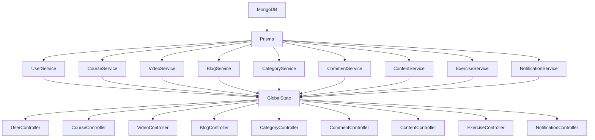
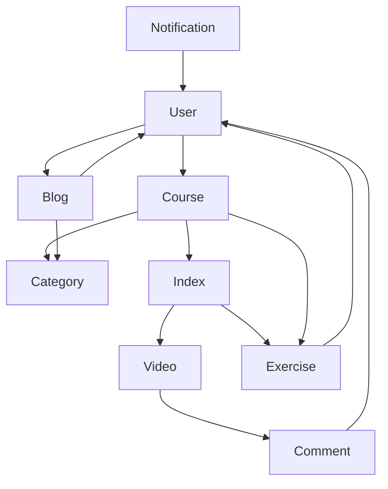

# Stay in touch

- Author - Hoàng An
- Facebook - [Nguyễn Hoàng An](https://www.facebook.com/profile.php?id=100026299908997)

## Installation

```bash
$ yarn
```

## Docker

Build

```bash
$  docker build -t gd-backend .
```

Run

```bash
$ docker run -dp 127.0.0.1:5000:5000 gd-backend
```

Stop and remove container
```bash
$ docker stop <the-container-id>
$ docker rm <the-container-id>
```

List your containers

```bash
$ docker ps
```

Repository

```bash
$ docker tag local-image:tagname new-repo:tagname

$ docker push new-repo:tagname
```
## Prisma

Written our schema

```bash
$ npx prisma db push
```

View collection

```bash
$ npx prisma studio
```

## Running the app

```bash
# development
$ yarn run start

# watch mode
$ yarn run dev

# production mode
$ yarn run start:prod
```

## Test

```bash
# unit tests
$ yarn run test

# e2e tests
$ yarn run test:e2e

# test coverage
$ yarn run test:cov
```

# Database

## Diagram service - controller



## Diagram relationship


