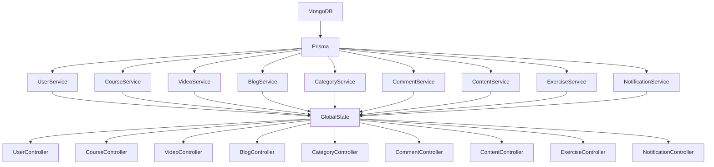
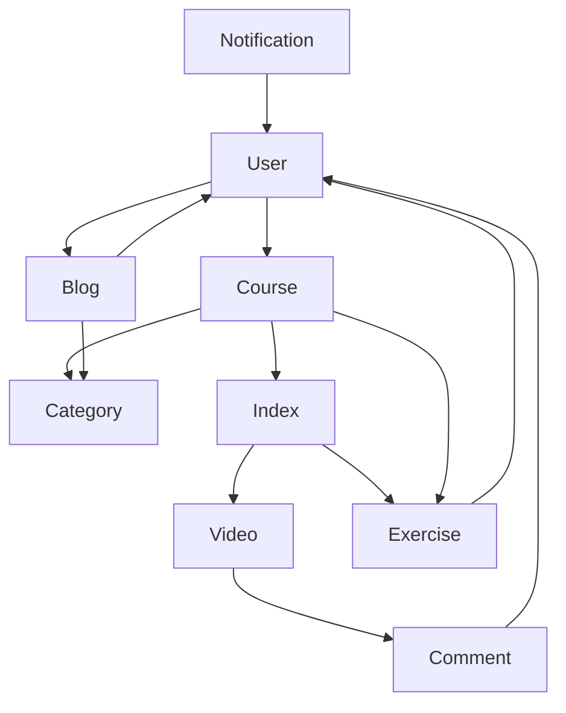

## Sơ đồ service - controller

```mermaid
flowchart  TD
    MongoDB --> Prisma
    Prisma --> UserService --> GlobalState --> UserController
    Prisma --> CourseService --> GlobalState --> CourseController
    Prisma --> VideoService --> GlobalState --> VideoController
    Prisma --> BlogService --> GlobalState --> BlogController
    Prisma --> CategoryService --> GlobalState --> CategoryController
    Prisma --> CommentService --> GlobalState --> CommentController
    Prisma --> ContentService --> GlobalState --> ContentController
    Prisma --> ExerciseService --> GlobalState --> ExerciseController
    Prisma --> NotificationService --> GlobalState --> NotificationController
    
```

## Sơ đồ quan hệ

```mermaid
flowchart  TD
    User
    Category
    Course
    Comment
    Index
    Video
    Blog
    Exercise
    Notification

    Course --> Category
    Comment --> User
    Course --> Index
    Index --> Video
    Blog --> User
    Blog --> Category
    Index --> Exercise
    Course --> Exercise
    Exercise --> User
    Notification --> User
    Video --> Comment
    User --> Course
    User --> Blog
    
```